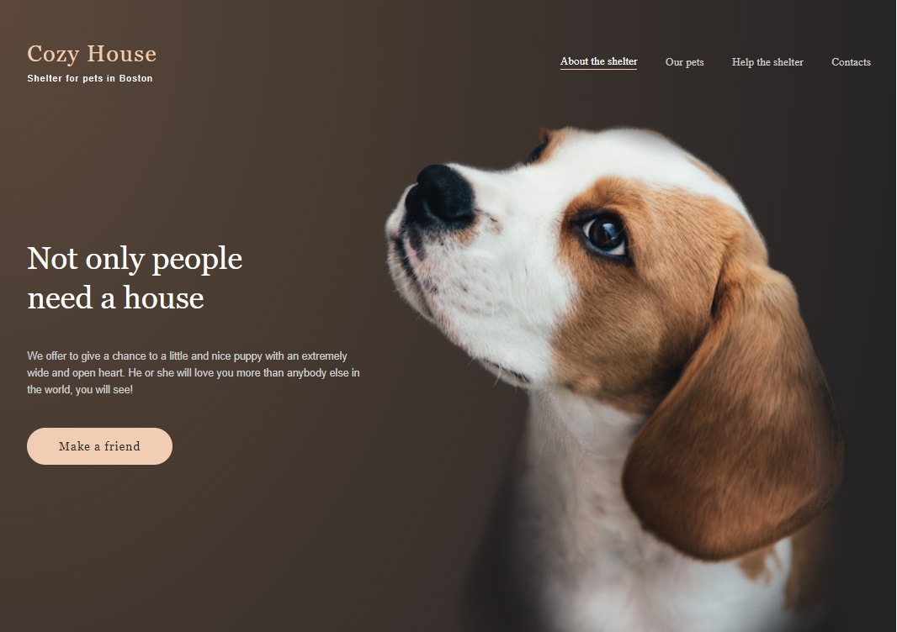

# Task 3. Shelter от [RSS School](https://rs.school/)

### **Проект Shelter [(готовый)]( https://marinatwice82.github.io/shelter/)**

Сверстать страницу согласно макету:

### [**Figma:**](https://www.figma.com/file/tKcmzkARtMUFQAR9VLdLkl/shelter-dom?node-id=94%3A43)

### Описание 

* Slider

    * Слайдер должен быть реализован со стрелками, при нажатии на которые случается переход на новый блок элементов.

    * Слайдер бесконечный, не имеет границ, т.е. можно нажимать влево и вправо сколько угодно раз, и каждый раз контент в блоках будет новый. В нашем случае, каждый новый слайд будет содержать псевдослучайный набор питомцев, т.е. формироваться из исходных объектов в случайном порядке, с двумя условиями. Во-первых, в самом блоке слайда карточки с питомцами повторяться не будут. Во-вторых, в следующем блоке, дублирующихся карточек с карточками текущего блока, не будет. Например в слайдере из 3 элементов, следующий выезжающий слайд будет содержать 3 новых карточки питомца, таких, каких не было среди 3х карточек на предыдущем уехавшем слайде.
* Popup
    * Попап - это отдельный элемент, который всплывает поверх страницы при нажатии на любое место элемента (блока) с описанием конкретного питомца, и центрируется. Остальная часть страницы затемняется. Цвет тени, форма попапа, кнопка его закрытия определены в дизайне макета Figma...
* Pets Page
    * В меню будут работать первые 2 элемента: About the shelter и Our pets. Остальные 2 пункта меню, хоть и будут присутствовать на странице, но будут неактивными, для чего можно использовать js.
*  Pagination
    * Самое важное: *при неизменных размерах области пагинации, возвращаясь на страницу под определенным номером, контент на ней всегда будет одинаков.*
    * При загрузке Our Pets должен быть сформирован массив из 48 элементов псевдо-случайным образом. Каждый из 8 приведенных на макете питомцев должен встречаться ровно 6 раз. При этом каждые 8, каждые 6, и каждые 3, питомца не должны повторяться. Т.е. на одной странице пагинации не может быть одноврменно два одинаковых питомца.

### [Описание задания](https://github.com/rolling-scopes-school/tasks/blob/master/tasks/markups/level-2/shelter/shelter-DOM-ru.md)
